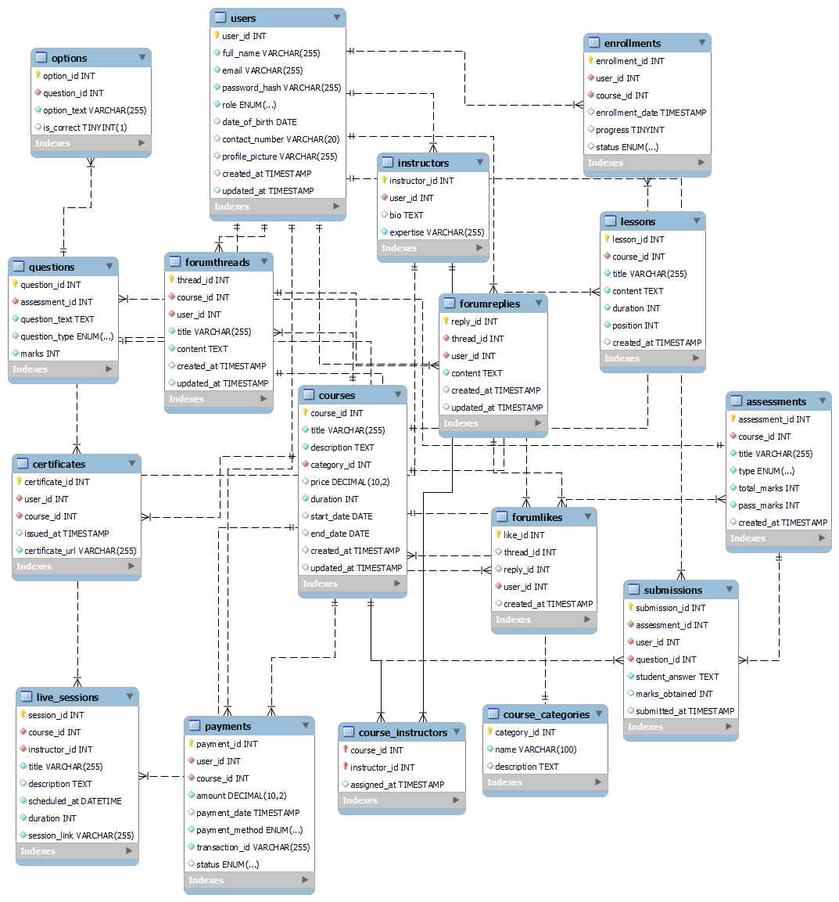

# SLMS (Student Learning Management System)

## Table of Contents

-   [Overview](#overview)
-   [How It Works](#how-it-works)
-   [Features](#features)
-   [Technology Stack](#technology-stack)
-   [Database Schema](#database-schema)
-   [Project Structure](#project-structure)
-   [Getting Started](#getting-started)
    -   [Prerequisites](#prerequisites)
    -   [Backend Setup](#backend-setup)
    -   [Frontend Setup](#frontend-setup)
    -   [Using Docker Compose](#using-docker-compose)
-   [API Endpoints (Overview)](#api-endpoints-overview)
-   [Development & Deployment Notes](#development--deployment-notes)
-   [Contribution Guidelines](#contribution-guidelines)
-   [License](#license)

## Overview

SLMS is a comprehensive, full-stack web application designed for online learning, course management, and student progress tracking. It features a robust backend powered by Django REST Framework and a modern, responsive frontend built with React and Vite. The system supports user authentication, course enrollment, quizzes, payments, and more, making it suitable for educational institutions and e-learning platforms.

---

## How It Works

SLMS is designed as a modular, scalable platform for online learning. The backend exposes a RESTful API for all operations, while the frontend consumes these APIs to provide a seamless user experience. Here’s how the main features work together:

-   **User Authentication & Roles**: Users can register as students or instructors. Admins manage the platform. JWT-based authentication secures all endpoints.
-   **Course Management**: Instructors create and manage courses, upload lessons, resources, and quizzes. Courses are categorized for easy discovery.
-   **Enrollment & Payment**: Students enroll in courses and complete payments using integrated payment methods. Enrollment status and payment are tracked.
-   **Learning Experience**: Students access video lessons, downloadable resources, and class recordings. Progress is tracked automatically.
-   **Quizzes & Certification**: Courses can include quizzes. Student performance is tracked, and certificates can be issued upon completion.
-   **Dashboard**: Both students and instructors have dashboards to track their activities, progress, and course management.
-   **Admin Panel**: Admins manage users, courses, and platform settings via Django’s admin interface.

---

## Features (Detailed)

-   **User registration, login, and role-based access**: Secure sign-up and login, with roles for students, instructors, and admins.
-   **Course creation and management**: Instructors can create, update, and organize courses, add lessons, modules, and resources.
-   **Video lessons and resources**: Upload and stream video content, attach downloadable files, and provide class recordings.
-   **Quizzes and progress tracking**: Add quizzes to courses, track student answers, and monitor progress.
-   **Payment and enrollment**: Integrated payment system for course purchases, with enrollment status and payment tracking.
-   **Student dashboard**: Personalized dashboard for students to view enrolled courses, progress, and certificates.
-   **RESTful API**: All backend operations are exposed via a secure, versioned API.
-   **Modern frontend**: Responsive, user-friendly interface built with React, Vite, and Tailwind CSS.
-   **Dockerized deployment**: Easily run the entire stack with Docker Compose.

---

## Technology Stack

### Backend

-   Python 3, Django 5, Django REST Framework
-   JWT Authentication
-   PostgreSQL (via Docker)
-   Docker/Docker Compose for containerization

### Frontend

-   React 19, Vite
-   Redux Toolkit, React Router
-   Tailwind CSS for styling

---

## Database Schema

A visual representation of the database schema is provided below. This schema illustrates the relationships between users, courses, enrollments, payments, quizzes, and other core entities.



Here’s how the main tables/entities relate:

-   **User**: Stores user information and roles. Each user can be a student, instructor, or admin.
-   **CourseCategory**: Organizes courses into categories.
-   **Course**: Contains course details, links to instructors, category, lessons, modules, and resources.
-   **Lesson/Module**: Courses are divided into modules and lessons for structured learning.
-   **Enrollment**: Connects users (students) to courses, tracks progress, payment status, and completion.
-   **Payment**: Linked to enrollments, tracks payment method, status, and transaction details.
-   **Quiz/MCQQuestion/Option/QuizResult**: Supports quizzes for courses, with questions, options, and results per student.
-   **ClassRecording/ClassResource**: Stores additional resources and class recordings for each course.

**Relationships:**

-   A user can enroll in many courses; a course can have many students (many-to-many via Enrollment).
-   Instructors can teach multiple courses; courses can have multiple instructors.
-   Each course can have multiple modules, lessons, quizzes, and resources.
-   Payments are linked to enrollments, ensuring only paid students access premium content.

---

## Project Structure

```
slms/
├── backend/         # Django backend (API, models, admin, etc.)
│   ├── core/        # Core app
│   ├── course/      # Course management (models, views, serializers)
│   ├── payment/     # Payment and enrollment
│   ├── useraccount/ # User management
│   └── slms/        # Django project settings and URLs
├── frontend/        # React frontend (Vite, src, components, pages)
│   ├── src/
│   │   ├── app/     # Redux store
│   │   ├── pages/   # Main pages (dashboard, courses, auth, etc.)
│   │   ├── components/ # Reusable UI components
│   │   └── ...
├── database/        # Database Docker setup and init scripts
├── database.schema.png # Database schema diagram
├── docker-compose.yml
├── LICENSE
├── Pipfile / requirements.txt
└── README.md
```

---

## Getting Started

### Prerequisites

-   Docker & Docker Compose
-   Node.js (for frontend development)

### Backend Setup

1.  Navigate to `backend/`:
    ```sh
    cd backend
    ```
2.  Install dependencies:
    ```sh
    pip install -r requirements.txt
    ```
3.  Run migrations:
    ```sh
    python manage.py migrate
    ```
4.  Create a superuser:
    ```sh
    python manage.py createsuperuser
    ```
5.  Start the backend server:
    ```sh
    python manage.py runserver
    ```

### Frontend Setup

1.  Navigate to `frontend/`:
    ```sh
    cd frontend
    ```
2.  Install dependencies:
    ```sh
    npm install
    ```
3.  Start the development server:
    ```sh
    npm run dev
    ```

### Using Docker Compose

To run the full stack (backend, frontend, database) with Docker Compose:

```sh
docker-compose up --build
```

---

## API Endpoints (Overview)

-   `/api/v1/user/` – User registration, login, profile
-   `/api/v1/courses/` – Course listing, details, enrollment
-   `/api/v1/purchase/` – Payment and enrollment

See the code for detailed API structure and authentication requirements.

---

## Development & Deployment Notes

-   Backend uses Django REST Framework with JWT authentication
-   Frontend uses React, Redux Toolkit, and Tailwind CSS
-   Environment variables are managed via `.env` files
-   Media uploads are stored in `backend/media/`
-   Database schema is initialized via `database/init.sql` (see Docker setup)
-   For production, set `DEBUG = False` and configure allowed hosts and secrets

---

## Contribution Guidelines

1.  Fork the repository and create your branch from `main`.
2.  Ensure code follows project conventions and is well-documented.
3.  Write tests for new features and bug fixes.
4.  Submit a pull request with a clear description of your changes.

---

## License

This project is licensed under the MIT License.
